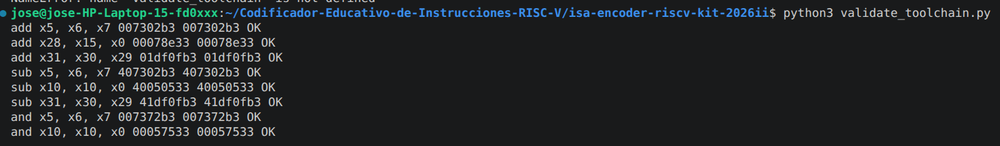

## Documentacion tecnica
A continuacion se presenta lo solicitado para el proyecto.
## 1. Instrucciones soportadas

El codificador implementa las siguientes instrucciones de la arquitectura
RISC-V RV32I:

| Formato | Instrucciones |
|---------|---------------|
| R | add, sub, and, or |
| I | addi, andi, lw, lb |
| S | sw, sb |
| B | beq, bne |

Cada instrucción recibe una cadena de texto con la sintaxis del ensamblador
RISC-V y retorna su codificación correspondiente de 32 bits.

## 2. Obtención de campos de codificación

Los campos utilizados para generar las instrucciones fueron obtenidos del
manual oficial:

RISC-V User-Level ISA Volume I:
Unprivileged ISA (versión 20191213).

Cada instrucción se divide en campos dependiendo del formato utilizado.

### Instruccion tipo R

Utilizado por instrucciones aritméticas entre registros.

La estructura es:

| Campo | Bits |
|-|-|
| funct7 | 31-25 |
| rs2 | 24-20 |
| rs1 | 19-15 |
| funct3 | 14-12 |
| rd | 11-7 |
| opcode | 6-0 |

Ejemplo:
add x5, x6, x7

Se utilizan:
opcode = 0110011
funct3 = 000
funct7 = 0000000

Ejemplo de la salidad explicativa para el registro tipo R:

---

### Instruccion tipo I

Utilizado para inmediatos y cargas desde memoria.

Estructura:

| Campo | Bits |
|-|-|
| imm |31-20|
| rs1 |19-15|
| funct3|14-12|
| rd|11-7|
|opcode|6-0|


---

### Instruccion tipo S

Utilizado para instrucciones store.

Estructura:

| Campo | Bits |
|-|-|
| imm[11:5]|31-25|
| rs2 |24-20|
| rs1 |19-15|
| funct3|14-12|
| imm[4:0]|11-7|
| opcode|6-0|


---

### Instruccion tipo B

Utilizado para instrucciones de salto condicional.

Estructura:

| Campo | Bits |
|-|-|
| imm[12]|31|
| imm[10:5]|30-25|
| rs2|24-20|
| rs1|19-15|
| funct3|14-12|
| imm[4:1]|11-8|
| imm[11]|7|
| opcode|6-0|

## 3. Estructura del código

El programa está compuesto principalmente por dos funciones:

### encode_instruction()

Esta función recibe una instrucción en formato texto.

Ejemplo:
add x5, x6, x7

Primero realiza un parseo de la cadena para separar:

- mnemónico
- registros fuente
- registro destino
- valores inmediatos


Posteriormente identifica el formato de la instrucción:

- R
- I
- S
- B


Finalmente ensambla los campos mediante operaciones de desplazamiento
de bits (`<<`) y combinación lógica OR (`|`).


Ejemplo:

```python
word = (
    funct7 << 25 |
    rs2 << 20 |
    rs1 << 15 |
    funct3 << 12 |
    rd << 7 |
    opcode
)
El resultado es una palabra de 32 bits almacenada como entero.

### explain_instruction()
ESta funcion se encarga de mostrar en consola el tipo de instruccion, los formatos en bin y hex, tambien se muestra como esta dividida cada parte del la instruccion dependiendo del tipo.
---

# 4. Ejemplos de salida explicativa

Aquí debes colocar capturas o texto de 4 instrucciones:

Una por formato:

- R → add
- I → addi
- S → sw
- B → beq

Ejemplo:


## 5. Validación contra herramienta oficial

La validación se realizó utilizando el toolchain oficial RISC-V.

Para cada instrucción se generaron tres casos diferentes,
considerando registros diferentes y valores inmediatos positivos,
negativos y límites.

La comparación se realizó mediante:

- codificación generada por el estudiante
- codificación obtenida mediante objdump


Ejemplo:

| Instrucción          | Hexade       | objdump      | Resultado |
|----------------------|--------------|--------------|----------|
| add x5, x6, x7       | 0x007302b3   | 0x007302b3   | True     |
| add x28, x15, x0     | 0x00078e33   | 0x00078e33   | True     |
| add x31, x30, x29    | 0x01df0fb3   | 0x01df0fb3   | True     |
| sub x5, x6, x7       | 0x407302b3   | 0x407302b3   | True     |
| sub x10, x10, x0     | 0x40050533   | 0x40050533   | True     |
| sub x31, x30, x29    | 0x41df0fb3   | 0x41df0fb3   | True     |
| and x5, x6, x7       | 0x007372b3   | 0x007372b3   | True     |
| and x10, x10, x0     | 0x00057533   | 0x00057533   | True     |
| and x31, x30, x29    | 0x01df7fb3   | 0x01df7fb3   | True     |
| or x5, x6, x7        | 0x007362b3   | 0x007362b3   | True     |
| or x10, x10, x0      | 0x00056533   | 0x00056533   | True     |
| or x31, x30, x29     | 0x01df6fb3   | 0x01df6fb3   | True     |
| addi x5, x6, 10      | 0x00a30293   | 0x00a30293   | True     |
| addi x10, x1, -12    | 0xff408513   | 0xff408513   | True     |
| addi x31, x30, 2047  | 0x7fff0f93   | 0x7fff0f93   | True     |
| andi x5, x6, 10      | 0x00a37293   | 0x00a37293   | True     |
| andi x10, x1, -12    | 0xff40f513   | 0xff40f513   | True     |
| andi x31, x30, 2047  | 0x7fff7f93   | 0x7fff7f93   | True     |
| lw x5, 8(x6)         | 0x00832283   | 0x00832283   | True     |
| lw x10, -16(x1)      | 0xff00a503   | 0xff00a503   | True     |
| lw x31, 2047(x30)    | 0x7fff2f83   | 0x7fff2f83   | True     |
| lb x5, 8(x6)         | 0x00830283   | 0x00830283   | True     |
| lb x10, -16(x1)      | 0xff008503   | 0xff008503   | True     |
| lb x31, 2047(x30)    | 0x7fff0f83   | 0x7fff0f83   | True     |
| sw x5, 8(x6)         | 0x00532423   | 0x00532423   | True     |
| sw x10, -16(x1)      | 0xfea0a823   | 0xfea0a823   | True     |
| sw x31, 2047(x30)    | 0x7fff2fa3   | 0x7fff2fa3   | True     |
| sb x5, 8(x6)         | 0x00530423   | 0x00530423   | True     |
| sb x10, -16(x1)      | 0xfea08823   | 0xfea08823   | True     |
| sb x31, 2047(x30)    | 0x7fff0fa3   | 0x7fff0fa3   | True     |
| beq x5, x6, 8        | 0x00628463   | 0x00628463   | True     |
| beq x10, x1, -4      | 0xfe150ee3   | 0xfe150ee3   | True     |
| beq x31, x30, 1024   | 0x41ef8063   | 0x41ef8063   | True     |
| bne x5, x6, 8        | 0x00629463   | 0x00629463   | True     |
| bne x10, x1, -4      | 0xfe151ee3   | 0xfe151ee3   | True     |
| bne x31, x30, 1024   | 0x41ef9063   | 0x41ef9063   | True     |


## Referencias
Andrew Waterman and Krste Asanović. The RISC-V Instruction Set Manual, Volume I: User-Level ISA, Document Version 20191213. RISC-V Foundation, 2019.